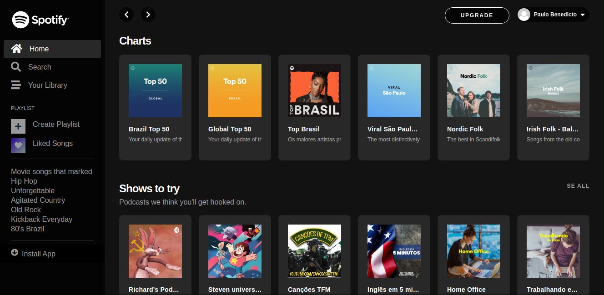

# Demo


## Menu
* [Tecnologias](#Tecnologias)
* [Como Utilizar](#Como-Utilizar)
* [About](#About)
* [Link do Curso](#Link-do-Curso)
* [License](#License)

## Tecnologias
Projeto desenvolvido com as seguintes tecnologias:
* HTML5
* CSS3
* Bootstrap 4
* JavaScript

## Como Utilizar
```
1. - Clone o repositório
$ git clone https://github.com/ale-mouraboni/spotify-interface.git

2. - Abra o index.html
```

## About
Esse projeto é um clone da interface do Spotify.  
Esse projeto foi desenvolvido com base no canal **Full Devs** **(Clonando Interface do Spotify com Bootstrap 4)**.

### Link do Curso:

* [Full Devs - Clonando Interface do Spotify com Bootstrap 4](https://www.youtube.com/playlist?list=PLyLHegP66K0kKeAODlZ9Ivh7Mm9i1_326)

## License
This project is under the MIT license. See the [LICENSE] for more information.

