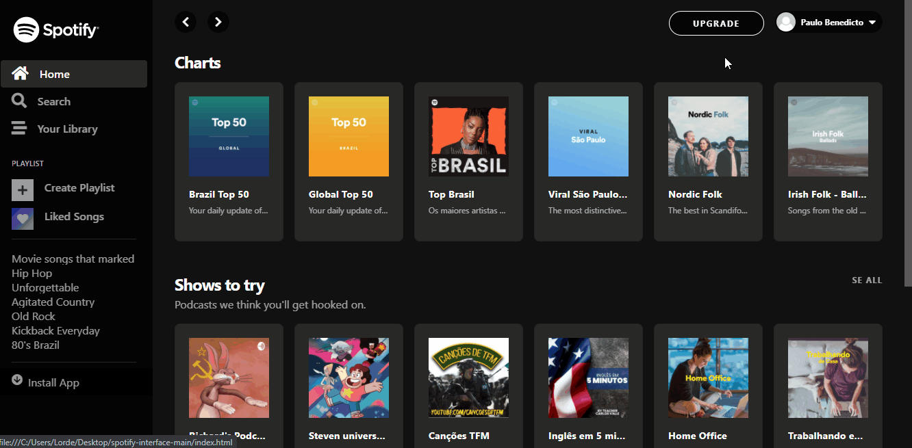

<h1 align="center">Clone Spotify</h1>
<p align="center">
  
</p>

<p align="center">
  Esse projeto foi desenvolvido com base no canal <a href="https://www.youtube.com/playlist?list=PLyLHegP66K0kKeAODlZ9Ivh7Mm9i1_326">Full Devs (Clonando Interface do Spotify com Bootstrap 4)</a>.
</p>

<p align="center">
  <a href="#technology">Tecnologias</a> | 
  <a href="#c-utilizar">Como Utilizar</a> |
  <a href="#about">About</a> |
  <a href="#license">Licence</a> 
</p>

<h2 id="technology">:globe_with_meridians: Tecnologias</h2>
<p>Projeto desenvolvido com as seguintes tecnologias:</p>
<ul>
  <li>HTML5</li>
  <li>CSS3</li>
  <li>Bootstrap 4</li>
  <li>JavaScript</li>
</ul>

<h2 id="c-utilizar">:wrench: Como Utilizar</h2>

```
#1 - Clone o repositório
$ git clone https://github.com/ale-mouraboni/spotify-interface.git

#2 - Abra o index.html
```

<h2 id="about">:heavy_check_mark: About</h2>
<p>Esse projeto é um Clone da interface do Spotify.
</br>
Esse projeto foi desenvolvido com base no canal Full Devs (Clonando Interface do Spotify com Bootstrap 4).
<h4>Responsive?</h4>
[ ] Yes  [x] No
</p>

<h2 id="license">:memo: License</h2>
<p>This project is under the MIT license. See the [LICENSE] for more information.
</p>
